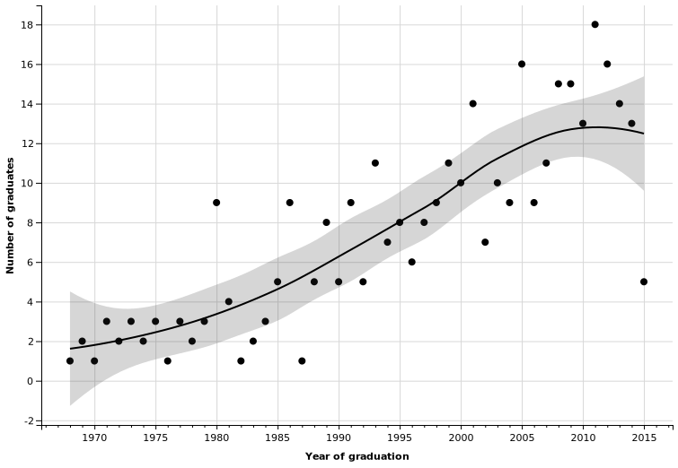

# README

## Stanford CS PhD Graduates

### Number of graduates by year

<!--html_preserve-->

<nav class="ggvis-control">

<ul class="ggvis-dropdown">
<li>
Renderer: 
<a id="plot_id773770339_renderer_svg" class="ggvis-renderer-button" onclick="return false;" data-plot-id="plot_id773770339" data-renderer="svg">SVG</a>
 | 
<a id="plot_id773770339_renderer_canvas" class="ggvis-renderer-button" onclick="return false;" data-plot-id="plot_id773770339" data-renderer="canvas">Canvas</a>
</li>
<li>
<a id="plot_id773770339_download" class="ggvis-download" data-plot-id="plot_id773770339">Download</a>
</li>
</ul>
</nav>

<!--/html_preserve-->

### With Master students

